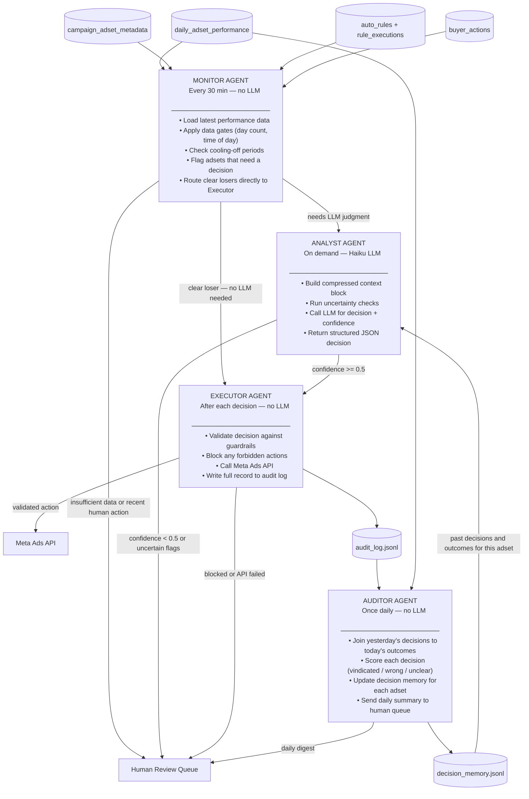

# Architecture: The Agent Army

## Overview

The existing auto-rule system makes fast decisions on incomplete data with no memory of past actions and no ability to self-correct. This document describes a four-agent replacement that solves that problem: it separates the act of *checking* from the act of *deciding*, enforces hard safety gates before anything reaches the Meta API, and runs a daily review loop so the system improves over time.

The mandate is to maintain or grow spend and absolute profit — not to maximise ROI by pausing everything. That mandate shapes every design decision below.

---

## 1. Agent Topology

Four agents. Each has a single job. No agent does another's job.



### What each agent sees and does

**Monitor Agent** — the filter

Reads all five CSVs fresh every 30 minutes. Runs a scoring pass on every active adset using pure arithmetic — no LLM call. Enforces the following gates before anything else happens:

- Does this adset have at least 3 days of spend data? If not → human queue, stop.
- Was an action taken on this adset in the last 4 hours? If yes → skip this cycle.
- Did a human buyer touch this adset in the last 24 hours? If yes → human queue, stop.
- Is it before 20:00 UTC and this is a day-1 adset? If yes → skip (day's revenue not settled yet).

Routes clear losers (ROI < -0.50 for 3+ consecutive days, no positive trend) directly to the Executor — no LLM needed. Everything else that needs a judgment call goes to the Analyst.

**Analyst Agent** — the decision-maker

Receives a single adset ID from the Monitor. Builds a compressed context block (under 500 tokens) covering: last 7 days of performance, current budget and bid strategy, recent rule executions, recent buyer actions, any data quality flags, and the adset's decision memory from past cycles. Calls Haiku with a structured prompt and expects a JSON response: action, amount, confidence, reasoning, data_quality_flags. If confidence < 0.5 or the response fails to parse → routes to human queue instead of Executor.

**Executor Agent** — the gatekeeper

Receives a decision from the Analyst (or a pre-screened clear loser from the Monitor). Checks it against hard guardrails before anything touches the Meta API. If guardrails pass: calls the API and writes the full decision record to the audit log. If guardrails fail: blocks the action, logs the block reason, and notifies the human queue. Also triggers system-level kill-switches if limits are breached.

**Auditor Agent** — the reviewer

Runs once a day (e.g. 02:00 UTC, after the previous day's revenue has settled). Joins the previous day's audit log to the latest performance data. For each decision: was the adset better or worse the next day? Was the action vindicated? Updates `decision_memory.jsonl` — a per-adset running record of what was decided and what happened. This memory feeds back into the Analyst's context on the next decision for that adset. Also sends a daily digest to the human review queue covering total actions taken, estimated P&L impact, and any anomalies.

---

## 2. Decision Boundaries

Three tiers. The LLM only operates in the middle tier.

### Autonomous — agent acts without human input
- Budget change of 20% or less in either direction
- Pause an adset with ROI < -0.50 for 3 or more consecutive days AND total spend > $30
- Re-enable an adset the agent paused, if the Auditor flags it as a wrong call (next-day ROI was positive)

### Requires human approval — agent drafts, human confirms
- Any budget change greater than 20%
- Any action on an adset a human buyer touched in the last 24 hours
- Scaling a second adset from the same campaign as a current winner ("duplicate winner" — risk of cannibalisation)
- Any recommendation the Analyst makes with confidence between 0.3 and 0.5

### Forbidden — hard-coded, the LLM cannot override these
- Any action on an adset with fewer than 3 days of spend data
- Budget increase of more than 50% in a single action
- Two actions on the same adset within 4 hours
- Any automated action when the Executor's log shows more than 10 autonomous actions in the last hour (system kill-switch)
- Any automated action when the Meta API has returned 3 consecutive failures (API kill-switch)

---

## 3. Economics

### Cost for the 6-account POC

```
Active adsets:            ~1,000 across 6 accounts
Polling cycles per day:   48  (every 30 min)
% flagged per cycle:      ~5%  (Monitor gates filter out stable adsets)
LLM calls per day:        ~200-400  (most adsets are stable most of the time)

Model:                    claude-haiku-4-5
Input pricing:            $0.25 per million tokens
Output pricing:           $1.25 per million tokens
Tokens per decision:      ~500 input + ~150 output

Cost per decision:        (500 x $0.00000025) + (150 x $0.00000125) = ~$0.0003

400 decisions/day x $0.0003 = ~$0.12/day across all 6 accounts
```

The $30/day POC budget is not a constraint at this scale. The same rate supports ~2,500 accounts before hitting the limit.

### When to use which model

| Situation | Model | Reasoning |
|---|---|---|
| Clear loser (ROI < -0.50, 3+ days, no upward trend) | No LLM — pure rule | Don't spend tokens on an obvious call |
| Routine — moderate history, no flags | Haiku | Fast, cheap, sufficient |
| Ambiguous — trend contradicts today | Haiku, then human if confidence < 0.5 | LLM flags uncertainty; human decides |
| Insufficient data or incomplete revenue | No LLM — human queue immediately | An LLM cannot fix missing data |

### Break-even vs. a media buyer

One media buyer manages roughly 2–3 accounts and costs ~£35,000/year (~$44,000). At 600 accounts (100× the POC scale), this system's API cost is ~$20/day ($7,300/year) — less than one buyer's salary, handling 200–300× the account load.

---

## 4. Failure Modes and Guardrails

| # | Failure | What goes wrong | Guardrail | Kill-switch |
|---|---|---|---|---|
| 1 | **Acting on noise** | Agent pauses a winner based on one bad day | 3-day data gate + trend check before any action | If > 20% of active adsets paused autonomously in one day, halt all automated actions |
| 2 | **Early-day blindness** | Agent acts at 6am before the day's revenue has settled | Time-of-day gate in Monitor; revenue completeness check (fb_conversions / estimated) | Decisions blocked automatically if the ratio is below 0.85 on a day-1 or day-2 adset |
| 3 | **API token failure** | Decisions queue up but never execute — the R09 problem from Task A | Executor logs every API call and response; alerts on first failure | After 3 consecutive API failures, all automated actions stop until a human re-authenticates |
| 4 | **LLM bad output** | Agent returns a malformed budget figure or wrong action type | Executor validates: action must be in allowed list, amounts within bounds, JSON must parse | Any malformed or out-of-bounds response → blocked, logged as `parse_error`, human notified |
| 5 | **Campaign-level cascade** | All adsets in one campaign look bad; agent pauses them all and kills the campaign's spend | Executor caps pauses at 2 per campaign per 30-min cycle | If > 30% of a campaign's adsets paused in 24 hours, freeze the campaign and escalate |

---

## 5. Data Flow

### What each agent reads, and when

| Agent | Data pulled | Frequency | Purpose |
|---|---|---|---|
| Monitor | All 5 CSVs | Every 30 min | Full scan; gate checks; routing |
| Analyst | Last 7 days of performance for one adset + its metadata, recent rule executions, recent buyer actions, decision memory | Per flagged adset | Compressed into context block for LLM |
| Executor | Decision JSON; recent audit log (to check action counts) | Per decision | Validation; API call; logging |
| Auditor | Full previous day's audit log; latest performance data | Once daily | Outcome scoring; memory update |

### Context compression

The Analyst never sends raw CSV rows to the LLM. It builds a structured text block, for example:

```
ADSET: 31196781349398 | Account: ACC-04
Budget: $50/day | Bid: LOWEST_COST | Geo: UK
Spend day: 4 | Status: ACTIVE

PERFORMANCE (last 7 days):
  Jun-06: spend=$5.41  roi=+0.26  conversions=12
  Jun-07: spend=$0.00  [paused by rule R08]
  Jun-08: spend=$4.90  roi=+0.19  conversions=10

RECENT RULE ACTIONS:
  Jun-06 04:30 UTC — R08 Turn OFF (today_roi=-0.75 at firing time)

RECENT BUYER ACTIONS: none in last 7 days

DATA FLAGS: revenue_delay_suspected (3-day roi=+0.22 but today roi=-0.90)
```

This keeps every decision under 500 input tokens regardless of how much raw history exists.

### The feedback memory

`decision_memory.jsonl` is a running log, one record per adset per decision:

```json
{
  "adset_id": "31196781349398",
  "decision_date": "2026-06-10",
  "action": "keep",
  "confidence": 0.72,
  "reasoning": "3-day trend positive; today dip suspected revenue delay",
  "outcome_roi_next_day": 0.31,
  "vindicated": true
}
```

The Analyst receives the last 3 entries for an adset before making a new call. This is how the system improves over time without retraining a model.

---

## 6. What This POC Does Not Cover

- **No live Meta API connection** — the POC runs against snapshot CSVs. The Executor's API call is stubbed.
- **No duplicate winner logic** — identifying and scaling winners is routed to human approval; the agent does not attempt it autonomously.
- **No multi-account isolation** — in production each account should have independent kill-switch state. The POC treats all 6 as one pool.
- **No model retraining** — the feedback loop updates decision context (memory), not the underlying model weights.
- **Buyer actions history partially unverified** — the ID fix from Task A is applied in agent code, but buyer action history for non-ACC-04 accounts could not be validated during the investigation phase.
